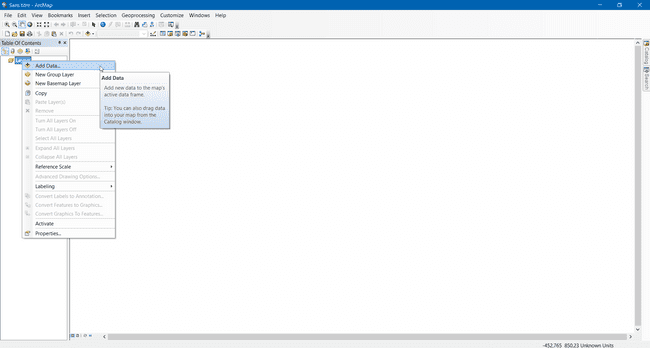
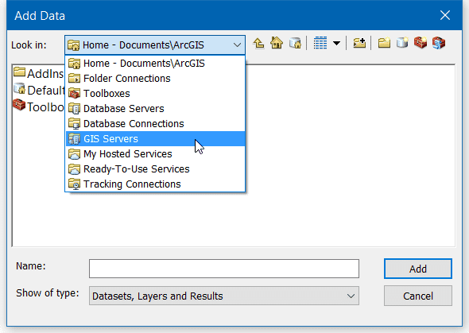
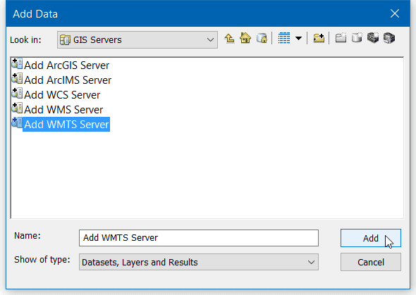
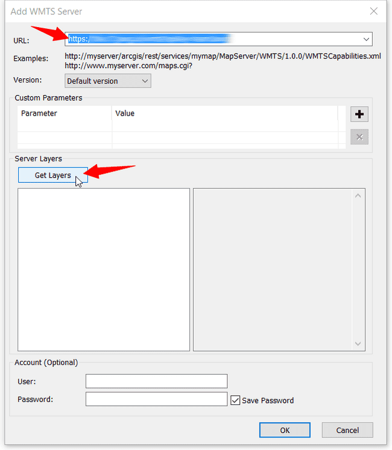
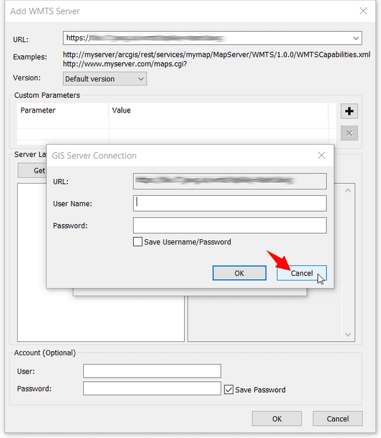
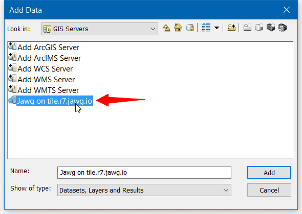
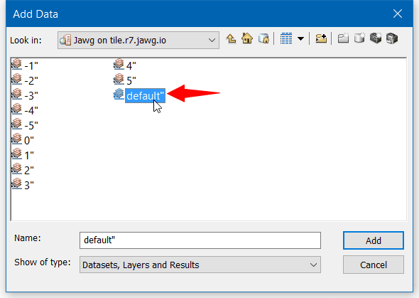
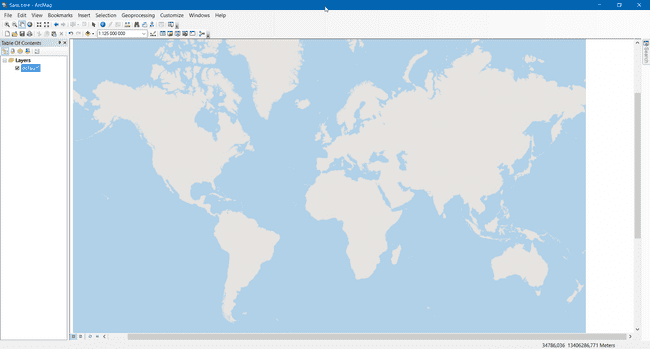

## Integrating MapSaudi in ArcGIS with WMTS and XYZ

Estimated reading time : 3 minutes

## Getting started

The following tutorial was created using the latest version of ArcGIS ArcMap Desktop. The process is however the same for versions 10.0 and newer. Thanks to these instructions, you could use WMTS to manipulate your different map layers in ArcGIS ArcMap.

## Retrieve data

The WMTS endpoint provided by MapSaudi is very simple :

`https://basemaps.mapsaudi.com/YOUR_STYLE_ID/wmts?access-token=YOUR_ACCESS_TOKEN`

You just need to replace YOUR_ACCESS_TOKEN by your real access token that you can find in your account and YOUR_STYLE_ID by your style ID. You can find your style id in Keys section:

## Tutorial

### Step 1

To import WMTS file layers in ArcMap, right-click on the **Layer** item on the left panel menu then **Add Data...**

### Step 2

In the new opened window, click on the dropdown list and select the **GIS Servers** item.

The window is refreshed and you can double-click on Add **WMTS Server...** or select the item and click **Add** to create a new data source for ArcMap.

### Step 3

A new window opens with settings to configure. Paste the link of your WMTS access in the first input then click on **Get Layers** to retrieve the WMTS data.

A window will appear to ask you for a login and a password, just click **Cancel** to connect without login. Click **OK** to accept the changes and close the settings window.

### Step 4

Once your WMTS server is added, double-click on the server name you've just created.

> Do not click on "Add" it won't connect to your server!

### Step 5

In the next view, you will be able to see the layers of your WMTS freshly imported from the web. Double-click on the layer you want to use in ArcMap.

And take a look at the result!

We hope that this tutorial was very helpful!
