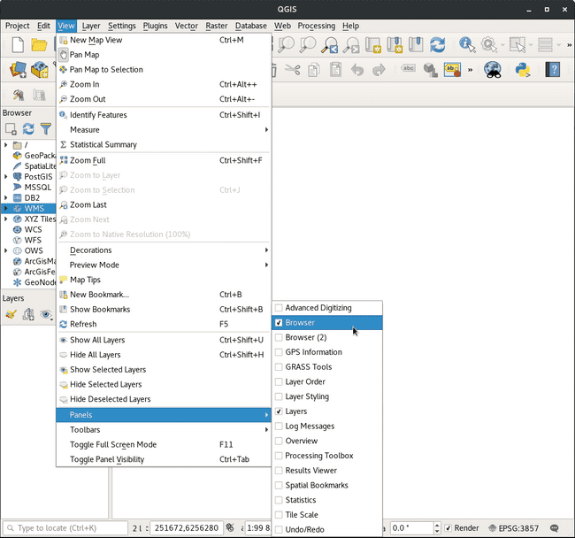
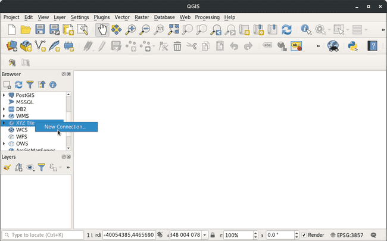
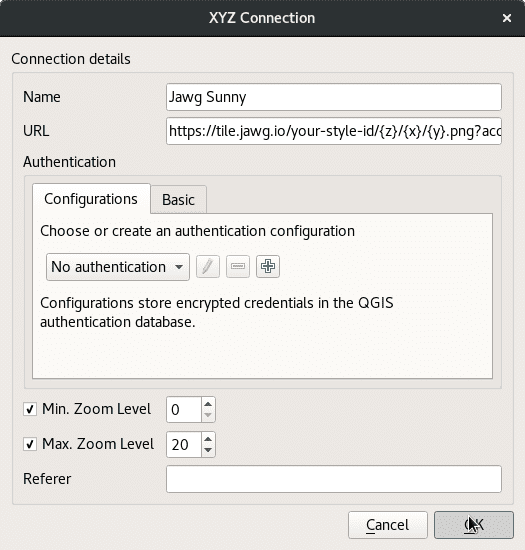
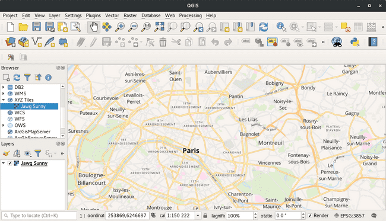
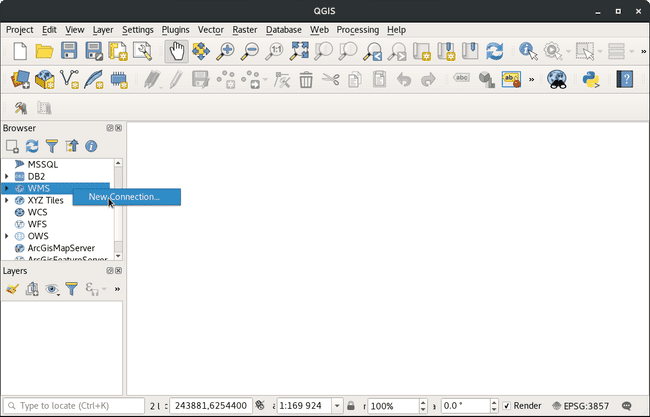
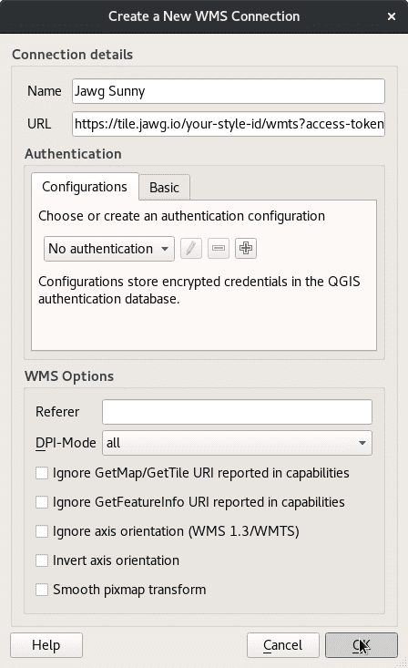
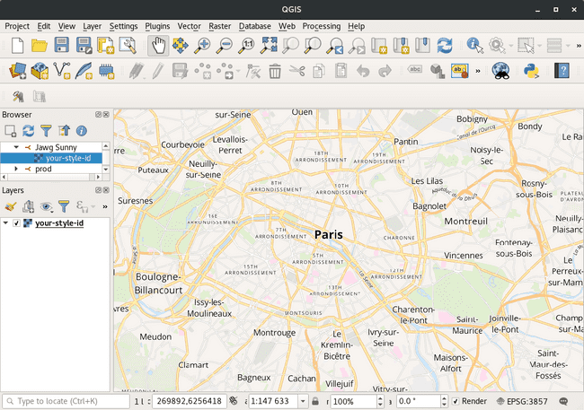

## Integrating MapSaudi in QGIS with WMTS and XYZ

Estimated reading time : 3 minutes

## Getting started

The following tutorial has been done on the latest version of QGIS. The process is however the same for older versions. Thanks to these instructions, you could use a WMS source to use your different map layers in QGIS.

## Requirements

Make sure that Browser view and Layers view are on. Click on the View tab on top of the QGIS window, then select Browser and Layers in the Panels section.



## XYZ Tutorial

First you need your XYZ endpoint. Get it from [MapSaudi Platform](https://app.mapsaudi.com/).

That's what it looks like :

```
https://basemaps.mapsaudi.com/your-style-id/{z}/{x}/{y}.png?access_token=your-MapSaudi-access-token
\___/   \___________________/\_____________/\_________/ \_/              \____________________/
  |               |             /              /          \                         |
scheme     domain            style ID  tiles coordinates  image format    authentication token
```

You just need to replace your-MapSaudi-access-token by your real access token that you can find in your account and your-style-id by your style ID. You can find your style id in Leaflet section in Style Manager:

> Tip: You can also use our default styles.

### Step 1

To import your XYZ layer in QGIS, go in the **Browser Panel**, find **XYZ Tiles**, right click on it and click on **New Connection...**



### Step 2

A new window opens with settings to configure:

- **Name**: Name of the layer you will create. We will use MapSaudi Sunny for our example, but you are free to choose what ever you want.
- **URL**: Link for XYZ tile source.
- **Max. Zoom Level**: You can set the max zoom level to 20.

Your new connection will be added in **XYZ** section on **Browser Panel**.



### step 3

Open your **XYZ** dropdown from you **Browser Panel** and find your new connection. Double click on your layer and voilà.



## WMTS Tutorial

First you need your WMTS endpoint. Get it from [MapSaudi Lab](https://app.mapsaudi.com/). The WMTS endpoint is very simple :

```
https://basemaps.mapsaudi.com/your-style-id/wmts?access_token=your-MapSaudi-access-token
\___/   \___________________/\_____________/                  \____________________/
  |               |               |                                    |
scheme         domain         style ID                         authentication token
```

You just need to replace your-MapSaudi-access-token by your real access token that you can find in your account and your-style-id by your style ID. You can find your style id in Leaflet section in Style Manager:

> Tip: You can also use our default styles.

### Step 1

To import your WMTS in QGIS, go in the **Browser Panel**, find **WMS**, right click on it and click on **New Connection...**



### Step 2

A new window opens with settings to configure:

- **Name**: Name of the layer you will create. We will use MapSaudi for our example, but you are free to choose what ever you want.
- **URL**: Path to the WMTS file or HTTP link to import. We will use a HTTP link from MapSaudi here.
  Other settings are left empty in our case. Your new connection will be added in **WMS** section on **Browser Panel**.



### Step 3

Open your **WMS** dropdown from you **Browser Panel** and find your new connection. Double click on your layer and voilà.


