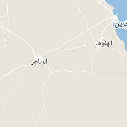
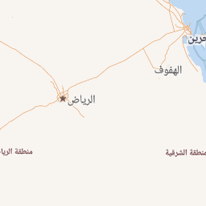
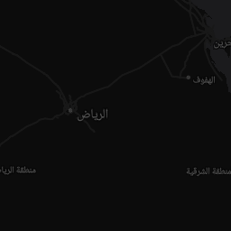
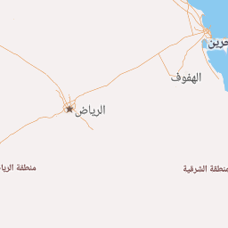
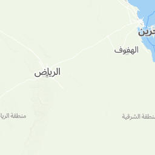
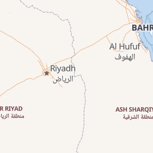

# Get Map API Reference

Estimated reading time : 3 minutes

## Map API
The Maps API allows you to retrieve vector or raster tiles generated by the lab. You can use some libraries like Leaflet or MapLibre GL for JavaScript, Android or iOS to add a map to your website.

## Endpoint to use
If you need tile URL, you should use this endpoint. We are supporting both raster png and vector pbf tiles.

```
https://basemaps.mapsaudi.com/styles/your-style-id.json/{z}/{x}/{y}.png?access_token=your-mapsaudi-access-token
\___/   \___________________/        \___________/      \________/                   \________________________/
  |              |                        |                 |                                    |
scheme        domain                  style ID       tiles coordinates                   authentication token
```

- **style ID**: your style ID or one of our default styles for raster tiles or streets-v2, landcover-v1, hillshade-v1 for vector tiles.
- **authentication token**: create your access token on the platform.

If you want your style as json for MapLibre GL you will need this endpoint:

```
https://basemaps.mapsaudi.com/styles/your-style-id.json?access_token=your-mapsaudi-access-token
\___/   \___________________/        \___________/                   \________________________/  
  |              |                        |                                     |                           
scheme        domain                  style ID                        authentication token          
```

- **style ID**: your style ID or one of our default styles or your custom style from the platform.
- **authentication token**: create your access token on the platform.

## MapSaudi default styles

We have some default styles which can be used by anyone with an access token. Here is our list (click on the image for a preview):

**Basic Arabic KSA Boundary**



**Bright Arabic KSA Boundary**



**Dark Matter Arabic KSA Boundary**



**Basic Arabic KSA Buildings**


**Bright Arabic KSA Boundary Secondary**



**Outdoor**



**Bright**


